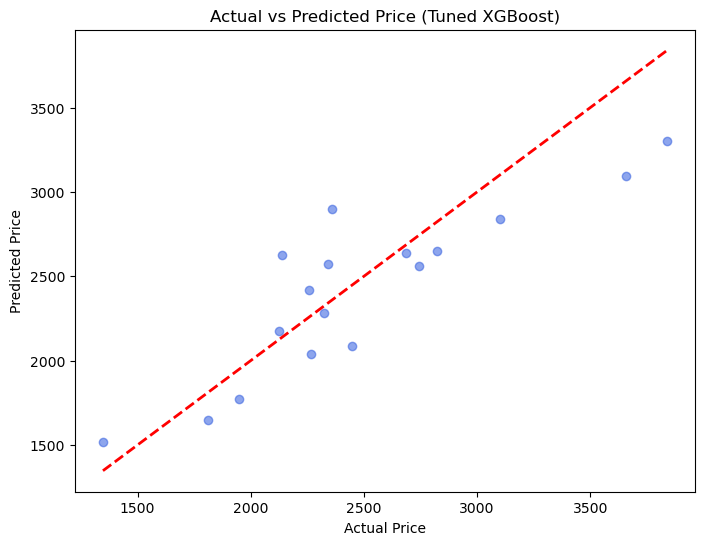

# Model Evaluation Summary

## 📄 Dataset
- Cleaned dataset: `Data/Clean/clean_cellphone.csv`
- Total records: XX (isi sesuai data kamu)
- Features: Sale, Resolution, PPI, CPU Core, CPU Freq, Internal Mem, RAM, Rear Cam, Front Cam, Battery
- Target: Price (Regression)

---

## Models Evaluation

| Model               | R² Score | RMSE    |
|:--------------------|:----------|:-----------|
| Random Forest        | 0.3825   | 476.80 |
| Gradient Boosting    | 0.4434   | 452.68 |
| XGBoost (Default)    | 0.6708   | 348.11 |
| **XGBoost (Tuned)**  | **0.7345** | **312.67** |

---

## Final Model
- **Model**: Tuned XGBoost Regressor
- **Parameter**:
  - n_estimators: 200
  - max_depth: 6
  - learning_rate: 0.05
  - subsample: 0.8
  - colsample_bytree: 0.8
  - random_state: 42
- Saved at: `Results/trained_model.pkl`

---

## Visualization Prediction

---

## Conclusion
- The tuned XGBoost model delivered the best performance.
- The most price influential features were: RAM, Battery, CPU Core, and Rear Camera.
- The model is ready to be used for predicting smartphone prices based on technical specifications.

